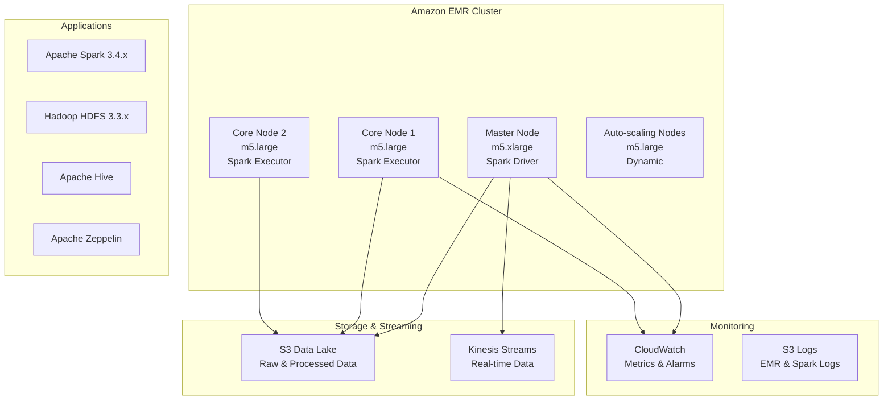

# Déploiement EMR - Pipeline Financier en Temps Réel

## Vue d'Ensemble

Ce document décrit le déploiement et l'utilisation du cluster Amazon EMR configuré pour le traitement de données financières en temps réel avec Apache Spark.

## Architecture EMR

### Composants Déployés



### Configuration des Instances

| Composant | Type Instance | CPU | RAM | Stockage | Rôle |
|-----------|---------------|-----|-----|----------|------|
| Master Node | m5.xlarge | 4 vCPU | 16 GB | 40GB EBS GP3 | Driver Spark, ResourceManager |
| Core Nodes | m5.large | 2 vCPU | 8 GB | 40GB EBS GP3 | Executors Spark, DataNodes |
| Auto-scaling | m5.large | 2 vCPU | 8 GB | 40GB EBS GP3 | Executors dynamiques |

## Déploiement Automatisé

### 1. Prérequis

```bash
# Outils requis
- Terraform >= 1.0
- AWS CLI >= 2.0
- Credentials AWS configurés

# Vérification
terraform --version
aws --version
aws sts get-caller-identity
```

### 2. Déploiement Complet

```bash
# Déploiement automatique
./scripts/deploy-emr.sh deploy

# Étapes exécutées automatiquement:
# 1. Validation des prérequis
# 2. Initialisation Terraform
# 3. Validation de la configuration
# 4. Déploiement de l'infrastructure
# 5. Attente de la disponibilité du cluster
# 6. Upload des jobs Spark
# 7. Test de validation
# 8. Affichage des informations de connexion
```

### 3. Commandes Utiles

```bash
# Test du cluster existant
./scripts/deploy-emr.sh test

# Informations de connexion
./scripts/deploy-emr.sh info

# Destruction du cluster
./scripts/deploy-emr.sh destroy
```

## Configuration Spark Optimisée

### Paramètres de Performance

```properties
# Allocation dynamique activée
spark.dynamicAllocation.enabled=true
spark.dynamicAllocation.minExecutors=1
spark.dynamicAllocation.maxExecutors=8

# Optimisations SQL adaptatives
spark.sql.adaptive.enabled=true
spark.sql.adaptive.coalescePartitions.enabled=true

# Sérialisation optimisée
spark.serializer=org.apache.spark.serializer.KryoSerializer

# Support Arrow pour PySpark
spark.sql.execution.arrow.pyspark.enabled=true

# Configuration S3A
spark.hadoop.fs.s3a.impl=org.apache.hadoop.fs.s3a.S3AFileSystem
spark.hadoop.fs.s3a.aws.credentials.provider=com.amazonaws.auth.InstanceProfileCredentialsProvider
```

### Configuration YARN

```xml
<!-- yarn-site.xml -->
<property>
    <name>yarn.resourcemanager.am.max-attempts</name>
    <value>1</value>
</property>
<property>
    <name>yarn.nodemanager.vmem-check-enabled</name>
    <value>false</value>
</property>
<property>
    <name>yarn.nodemanager.pmem-check-enabled</name>
    <value>false</value>
</property>
```

## Auto-scaling et Optimisation des Coûts

### 1. Auto-scaling Intelligent

```json
{
  "Rules": [
    {
      "Name": "ScaleOutMemoryPercentage",
      "Description": "Scale out if memory > 75%",
      "Trigger": {
        "CloudWatchAlarmDefinition": {
          "MetricName": "MemoryPercentage",
          "Threshold": 75.0,
          "ComparisonOperator": "GREATER_THAN"
        }
      },
      "Action": {
        "SimpleScalingPolicyConfiguration": {
          "AdjustmentType": "CHANGE_IN_CAPACITY",
          "ScalingAdjustment": 1
        }
      }
    },
    {
      "Name": "ScaleInMemoryPercentage", 
      "Description": "Scale in if memory < 25%",
      "Trigger": {
        "CloudWatchAlarmDefinition": {
          "MetricName": "MemoryPercentage",
          "Threshold": 25.0,
          "ComparisonOperator": "LESS_THAN"
        }
      },
      "Action": {
        "SimpleScalingPolicyConfiguration": {
          "AdjustmentType": "CHANGE_IN_CAPACITY",
          "ScalingAdjustment": -1
        }
      }
    }
  ]
}
```

### 2. Optimisations de Coût

| Fonctionnalité | Configuration | Économies |
|---------------|---------------|-----------|
| **Auto-termination** | 1h d'inactivité | ~60% sur développement |
| **Instances Spot** | 50% des core nodes | ~70% sur compute |
| **Compression** | Snappy pour Parquet | ~40% stockage |
| **Partitioning** | Par date/symbole | ~80% scan time |

### 3. Monitoring des Coûts

```bash
# Coût estimé par heure (région eu-west-1)
# Master m5.xlarge: ~$0.20/h
# Core m5.large: ~$0.10/h x2 = $0.20/h
# Total base: ~$0.40/h (~$300/mois)
# Avec Spot (50%): ~$0.30/h (~$220/mois)
# Avec auto-termination: ~$50-100/mois en développement
```

## Jobs Spark Financiers

### 1. Processeur Principal

Le job `financial_data_processor.py` inclut :

```python
# Fonctionnalités principales
- Lecture des données depuis S3/Kinesis
- Nettoyage et validation des données
- Calcul d'indicateurs techniques (SMA, RSI, etc.)
- Détection d'anomalies (Z-score)
- Génération de résumés de marché
- Sauvegarde optimisée en Parquet
```

### 2. Soumission de Jobs

```bash
# Via AWS CLI
aws emr add-steps --cluster-id j-XXXXXXXXX --steps file://spark-step.json

# Exemple de step.json
{
  "Name": "Financial Data Processing",
  "ActionOnFailure": "CONTINUE",
  "HadoopJarStep": {
    "Jar": "command-runner.jar",
    "Args": [
      "spark-submit",
      "--deploy-mode", "cluster",
      "--num-executors", "4",
      "--executor-memory", "2g",
      "--executor-cores", "2",
      "s3://your-bucket/spark-jobs/financial_data_processor.py",
      "2024-09-24"
    ]
  }
}
```

### 3. Monitoring des Jobs

```bash
# Statut du cluster
aws emr describe-cluster --cluster-id j-XXXXXXXXX

# Liste des steps
aws emr list-steps --cluster-id j-XXXXXXXXX

# Logs d'un step
aws emr describe-step --cluster-id j-XXXXXXXXX --step-id s-XXXXXXXXX

# Logs détaillés
aws s3 ls s3://your-bucket/emr-logs/j-XXXXXXXXX/steps/s-XXXXXXXXX/
```

## Accès et Interfaces Web

### 1. Tunneling SSH

```bash
# Configuration des tunnels SSH (si clé EC2 configurée)
ssh -i ~/.ssh/your-key.pem -L 8890:localhost:8890 hadoop@ec2-xxx.compute.amazonaws.com
ssh -i ~/.ssh/your-key.pem -L 4040:localhost:4040 hadoop@ec2-xxx.compute.amazonaws.com
ssh -i ~/.ssh/your-key.pem -L 8088:localhost:8088 hadoop@ec2-xxx.compute.amazonaws.com
```

### 2. Interfaces Disponibles

| Interface | Port | URL Local | Description |
|-----------|------|-----------|-------------|
| **Zeppelin** | 8890 | http://localhost:8890 | Notebooks interactifs |
| **Spark UI** | 4040 | http://localhost:4040 | Monitoring Spark |
| **YARN RM** | 8088 | http://localhost:8088 | ResourceManager |
| **HDFS NN** | 9870 | http://localhost:9870 | NameNode HDFS |

### 3. Zeppelin - Développement Interactif

```python
# Exemple de notebook Zeppelin
%pyspark

# Lecture des données
df = spark.read.parquet("s3a://your-bucket/processed-data/financial_indicators/")

# Analyse rapide
df.groupBy("market").agg(
    avg("close").alias("avg_price"),
    count("symbol").alias("symbols")
).show()

# Visualisation
%pyspark
import matplotlib.pyplot as plt
import pandas as pd

pandas_df = df.select("symbol", "close", "rsi").toPandas()
plt.figure(figsize=(12, 6))
plt.plot(pandas_df['close'])
plt.title('Evolution des prix')
plt.show()
```

## Sécurité et Conformité

### 1. IAM Roles et Permissions

```json
{
  "Version": "2012-10-17",
  "Statement": [
    {
      "Effect": "Allow",
      "Action": [
        "s3:GetObject",
        "s3:PutObject",
        "s3:ListBucket"
      ],
      "Resource": [
        "arn:aws:s3:::financial-pipeline-*",
        "arn:aws:s3:::financial-pipeline-*/*"
      ]
    },
    {
      "Effect": "Allow", 
      "Action": [
        "kinesis:DescribeStream",
        "kinesis:GetRecords",
        "kinesis:GetShardIterator"
      ],
      "Resource": "arn:aws:kinesis:*:*:stream/financial-*"
    }
  ]
}
```

### 2. Security Groups

```terraform
# Master Node Security Group
resource "aws_security_group" "emr_master" {
  # SSH (optionnel, via VPN/bastion)
  ingress {
    from_port   = 22
    to_port     = 22
    protocol    = "tcp"
    cidr_blocks = ["10.0.0.0/16"]
  }
  
  # Interfaces web
  ingress {
    from_port   = 8088
    to_port     = 8890
    protocol    = "tcp"
    cidr_blocks = ["10.0.0.0/16"]
  }
}
```

### 3. Chiffrement

```terraform
# Chiffrement au repos (S3)
server_side_encryption_configuration {
  rule {
    apply_server_side_encryption_by_default {
      sse_algorithm = "AES256"
    }
  }
}

# Chiffrement en transit (EMR)
encryption_configuration {
  at_rest_encryption_configuration {
    s3_encryption_configuration {
      encryption_mode = "SSE-S3"
    }
  }
  in_transit_encryption_configuration {
    tls_certificate_configuration {
      certificate_provider_type = "PEM"
    }
  }
}
```

## Troubleshooting

### 1. Problèmes de Démarrage

```bash
# Vérifier l'état du cluster
aws emr describe-cluster --cluster-id j-XXXXXXXXX --query 'Cluster.Status'

# Logs de bootstrap
aws s3 ls s3://your-bucket/emr-logs/j-XXXXXXXXX/node/*/bootstrap-actions/

# Problèmes courants:
# - Quotas EMR atteints
# - Types d'instances non disponibles
# - Permissions IAM insuffisantes
# - Configuration réseau (sous-réseaux, NAT)
```

### 2. Problèmes de Jobs

```bash
# Logs d'application Spark
aws s3 ls s3://your-bucket/emr-logs/j-XXXXXXXXX/containers/application_*/

# Logs du driver
aws s3 cp s3://your-bucket/emr-logs/j-XXXXXXXXX/containers/application_*/container_*/stdout.gz .

# Erreurs communes:
# - OutOfMemoryError: Augmenter executor-memory
# - S3 403 Forbidden: Vérifier les permissions IAM
# - Timeout Kinesis: Vérifier la configuration réseau
```

### 3. Optimisation des Performances

```python
# Tuning Spark pour données financières
spark.conf.set("spark.sql.adaptive.coalescePartitions.parallelismFirst", "false")
spark.conf.set("spark.sql.adaptive.advisoryPartitionSizeInBytes", "128MB")
spark.conf.set("spark.sql.adaptive.skewJoin.enabled", "true")

# Optimisation des lectures S3
spark.conf.set("spark.hadoop.fs.s3a.connection.maximum", "200")
spark.conf.set("spark.hadoop.fs.s3a.fast.upload", "true")
spark.conf.set("spark.hadoop.fs.s3a.block.size", "134217728")  # 128MB
```

## Maintenance et Mise à Jour

### 1. Mise à Jour EMR

```bash
# Nouvelles versions EMR
# 1. Tester sur cluster de dev
# 2. Mettre à jour emr_release_label
# 3. Redéployer avec le script

# Exemple de mise à jour
# Dans variables.tf:
variable "emr_release_label" {
  default = "emr-6.16.0"  # Nouvelle version
}
```

### 2. Sauvegarde et Restauration

```bash
# Sauvegarde des configurations
aws s3 sync /etc/spark/conf/ s3://your-bucket/backups/spark-config/
aws s3 sync /etc/hadoop/conf/ s3://your-bucket/backups/hadoop-config/

# Sauvegarde des notebooks Zeppelin
aws s3 sync /var/lib/zeppelin/notebook/ s3://your-bucket/backups/zeppelin-notebooks/
```

### 3. Monitoring Continu

```bash
# Alertes CloudWatch configurées
# - CPU > 80% pendant 2 périodes
# - Mémoire > 85% pendant 2 périodes
# - Échec de jobs critiques
# - Coûts dépassant le budget

# Vérification hebdomadaire
aws emr list-clusters --active
aws ce get-cost-and-usage --time-period Start=2024-09-01,End=2024-09-30
```

## Performance et Benchmarks

### 1. Métriques de Performance

| Métrique | Cible | Mesure |
|----------|--------|--------|
| **Démarrage cluster** | < 10 minutes | Temps jusqu'à WAITING |
| **Traitement 1GB données** | < 5 minutes | Job Spark simple |
| **Indicateurs techniques** | < 2 minutes | 100k lignes |
| **Détection anomalies** | < 1 minute | 50k lignes |

### 2. Optimisations Appliquées

```python
# Partitioning intelligent
df.write \
  .partitionBy("market", "date") \
  .mode("overwrite") \
  .option("compression", "snappy") \
  .parquet("s3a://bucket/processed-data/")

# Cache des données fréquemment utilisées
df_prices.cache()
df_indicators = calculate_indicators(df_prices)
df_indicators.persist(StorageLevel.MEMORY_AND_DISK)

# Broadcast des petites tables
broadcast_symbols = spark.sparkContext.broadcast(symbol_metadata)
```

### 3. Monitoring en Temps Réel

```python
# Métriques custom dans Spark
spark.sparkContext.statusTracker().getExecutorInfos()

# Intégration CloudWatch
import boto3
cloudwatch = boto3.client('cloudwatch')

cloudwatch.put_metric_data(
    Namespace='EMR/FinancialPipeline',
    MetricData=[
        {
            'MetricName': 'RecordsProcessed',
            'Value': record_count,
            'Unit': 'Count'
        }
    ]
)
```

---

## Conclusion

Cette configuration EMR offre une plateforme robuste et évolutive pour le traitement de données financières en temps réel, avec des optimisations de coût et de performance adaptées aux workloads financiers.

Pour plus de détails, consulter :
- [Module Terraform EMR](../infrastructure/terraform/modules/emr/README.md)
- [Jobs Spark](../spark-jobs/)
- [Scripts de déploiement](../scripts/)
