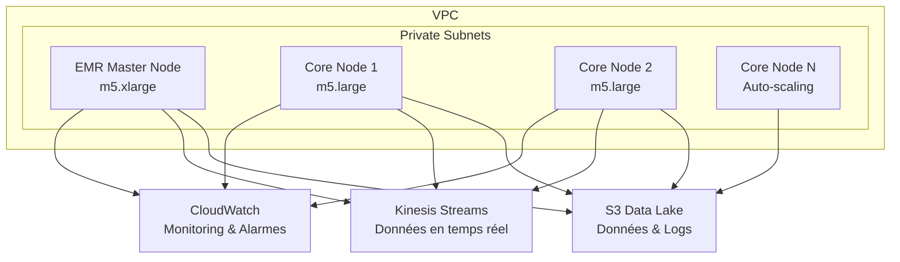

# Module EMR Terraform - Pipeline Financier en Temps Réel

Ce module Terraform déploie un cluster Amazon EMR optimisé pour le traitement de données financières en temps réel avec Apache Spark.

## Fonctionnalités

### 🚀 Configuration du Cluster
- **EMR 6.15.0** avec Spark, Hadoop, Hive et Zeppelin
- **Auto-scaling** intelligent basé sur l'utilisation de CPU/mémoire
- **Optimisation des coûts** avec arrêt automatique et support des instances Spot
- **Sécurité renforcée** avec security groups dédiés et IAM roles

### 📊 Applications Incluses
- **Apache Spark** - Traitement distribué des données financières
- **Hadoop HDFS** - Stockage distribué
- **Apache Hive** - Requêtes SQL sur big data
- **Apache Zeppelin** - Notebooks interactifs pour l'analyse

### 🔧 Auto-scaling et Performance
- Scaling automatique basé sur les métriques CloudWatch
- Configuration Spark optimisée pour les workloads financiers
- Support de l'allocation dynamique des executors
- Monitoring intégré avec alarmes CloudWatch

## Architecture



## Utilisation

### Configuration de Base

```hcl
module "emr" {
  source = "../../modules/emr"

  project_name        = "financial-pipeline"
  environment         = "dev"
  vpc_id             = module.vpc.vpc_id
  private_subnet_ids = module.vpc.private_subnet_ids
  s3_bucket_name     = module.data_lake.bucket_name

  # Configuration des instances
  master_instance_type = "m5.xlarge"
  core_instance_type   = "m5.large"
  core_instance_count  = 2

  # Auto-scaling
  auto_scaling_min_capacity = 1
  auto_scaling_max_capacity = 10

  # Optimisation des coûts
  auto_termination_timeout = 3600  # 1 heure
  spot_instance_percentage = 50    # 50% d'instances Spot
}
```

### Configuration de Production

```hcl
module "emr_prod" {
  source = "../../modules/emr"

  project_name        = "financial-pipeline"
  environment         = "prod"
  vpc_id             = module.vpc.vpc_id
  private_subnet_ids = module.vpc.private_subnet_ids
  s3_bucket_name     = module.data_lake.bucket_name

  # Configuration robuste pour la production
  master_instance_type = "m5.2xlarge"
  core_instance_type   = "m5.xlarge"
  core_instance_count  = 4

  # Auto-scaling conservateur
  auto_scaling_min_capacity = 2
  auto_scaling_max_capacity = 20

  # Sécurité et stabilité
  enable_termination_protection = true
  auto_termination_timeout      = 7200  # 2 heures
  spot_instance_percentage      = 30     # 30% d'instances Spot

  # Monitoring renforcé
  cpu_alarm_threshold    = 75
  memory_alarm_threshold = 80

  # Configuration Spark avancée
  spark_max_executors   = 16
  spark_executor_memory = "4g"
  spark_executor_cores  = 4
}
```

## Variables d'Entrée

| Variable | Type | Défaut | Description |
|----------|------|--------|-------------|
| `project_name` | string | - | **Requis.** Nom du projet pour le tagging |
| `environment` | string | - | **Requis.** Environnement (dev/staging/prod) |
| `vpc_id` | string | - | **Requis.** ID du VPC |
| `private_subnet_ids` | list(string) | - | **Requis.** IDs des sous-réseaux privés |
| `s3_bucket_name` | string | - | **Requis.** Nom du bucket S3 |
| `master_instance_type` | string | `"m5.xlarge"` | Type d'instance master |
| `core_instance_type` | string | `"m5.large"` | Type d'instance core |
| `core_instance_count` | number | `2` | Nombre initial d'instances core |
| `auto_scaling_min_capacity` | number | `1` | Capacité minimale d'auto-scaling |
| `auto_scaling_max_capacity` | number | `10` | Capacité maximale d'auto-scaling |
| `key_name` | string | `null` | Nom de la clé EC2 pour SSH |
| `auto_termination_timeout` | number | `3600` | Délai d'arrêt automatique (secondes) |
| `spot_instance_percentage` | number | `0` | Pourcentage d'instances Spot (0-100) |

## Sorties

| Output | Description |
|--------|-------------|
| `cluster_id` | ID du cluster EMR |
| `cluster_name` | Nom du cluster EMR |
| `master_public_dns` | DNS public du nœud master |
| `spark_ui_url` | URL de l'interface Spark |
| `yarn_ui_url` | URL de l'interface YARN |
| `zeppelin_url` | URL de Zeppelin |
| `ssh_command` | Commande SSH pour se connecter |

## Optimisations de Coût

### 1. Auto-scaling Intelligent
- Scaling basé sur l'utilisation CPU/mémoire
- Ajout/suppression automatique d'instances
- Seuils configurables par environnement

### 2. Instances Spot
- Support configurable des instances Spot EC2
- Réduction des coûts jusqu'à 90%
- Gestion automatique des interruptions

### 3. Arrêt Automatique
- Arrêt automatique après inactivité
- Évite les coûts de clusters oubliés
- Délai configurable par environnement

### 4. Stockage Optimisé
- Volumes EBS GP3 pour de meilleures performances
- Compression automatique des logs
- Nettoyage automatique des anciens logs

## Sécurité

### IAM Roles et Policies
- Rôle de service EMR avec permissions minimales
- Rôle d'instance avec accès S3/Kinesis restreint
- Rôle d'auto-scaling dédié

### Network Security
- Déploiement dans des sous-réseaux privés uniquement
- Security groups restrictifs
- Accès aux APIs AWS via VPC endpoints

### Monitoring et Alarmes
- Alarmes CloudWatch pour CPU/mémoire
- Logs centralisés dans S3
- Monitoring des coûts automatique

## Scripts de Bootstrap

Le module inclut un script de bootstrap automatique qui installe :

```bash
# Packages Python pour l'analyse financière
pip3 install pandas numpy boto3 pyspark
pip3 install yfinance alpha_vantage plotly
pip3 install scikit-learn seaborn requests

# Configuration Spark optimisée
export SPARK_HOME=/usr/lib/spark
export PYTHONPATH=$SPARK_HOME/python/lib/pyspark.zip:$PYTHONPATH
```

## Monitoring et Observabilité

### CloudWatch Metrics
- Utilisation CPU/mémoire par nœud
- Métriques YARN et Spark
- Statut des jobs et applications

### Alarmes Configurées
- **CPU High**: Seuil > 80% (configurable)
- **Memory High**: Seuil > 85% (configurable)
- **Auto-scaling Events**: Notification des événements

### Logs Centralisés
- Logs EMR dans S3
- Logs Spark et Hadoop
- Logs d'applications personnalisées

## Accès et Développement

### Interfaces Web
- **Spark UI**: Port 4040 (monitoring des jobs)
- **YARN ResourceManager**: Port 8088 (gestion des ressources)
- **Zeppelin**: Port 8890 (notebooks interactifs)

### Tunneling SSH
```bash
# Tunnel SSH pour accéder aux interfaces web
ssh -i ~/.ssh/your-key.pem -L 8890:localhost:8890 hadoop@<master-dns>
ssh -i ~/.ssh/your-key.pem -L 4040:localhost:4040 hadoop@<master-dns>
ssh -i ~/.ssh/your-key.pem -L 8088:localhost:8088 hadoop@<master-dns>
```

### Soumission de Jobs
```bash
# Spark-submit depuis le master node
spark-submit \
  --master yarn \
  --deploy-mode cluster \
  --num-executors 4 \
  --executor-memory 2g \
  --executor-cores 2 \
  s3://your-bucket/spark-jobs/financial-analysis.py
```

## Configuration Spark

### Optimisations Incluses
```properties
# Allocation dynamique activée
spark.dynamicAllocation.enabled=true
spark.dynamicAllocation.minExecutors=1
spark.dynamicAllocation.maxExecutors=8

# Optimisations SQL
spark.sql.adaptive.enabled=true
spark.sql.adaptive.coalescePartitions.enabled=true

# Sérialisation optimisée
spark.serializer=org.apache.spark.serializer.KryoSerializer

# Support Arrow pour PySpark
spark.sql.execution.arrow.pyspark.enabled=true

# Configuration S3A
spark.hadoop.fs.s3a.impl=org.apache.hadoop.fs.s3a.S3AFileSystem
spark.hadoop.fs.s3a.aws.credentials.provider=com.amazonaws.auth.InstanceProfileCredentialsProvider
```

## Exemples d'Usage

### Traitement de Données Financières
```python
from pyspark.sql import SparkSession
from pyspark.sql.functions import *

# Initialisation Spark
spark = SparkSession.builder \
    .appName("FinancialDataProcessing") \
    .getOrCreate()

# Lecture des données depuis S3
df = spark.read.parquet("s3a://your-bucket/financial-data/")

# Calcul d'indicateurs techniques
df_with_indicators = df \
    .withColumn("sma_20", avg("close").over(window_spec)) \
    .withColumn("rsi", calculate_rsi("close"))

# Sauvegarde des résultats
df_with_indicators.write \
    .mode("overwrite") \
    .parquet("s3a://your-bucket/processed-data/")
```

### Streaming depuis Kinesis
```python
# Lecture de stream Kinesis
kinesis_df = spark \
    .readStream \
    .format("kinesis") \
    .option("streamName", "financial-data-stream") \
    .option("region", "eu-west-1") \
    .load()

# Traitement en temps réel
processed_df = kinesis_df \
    .select(from_json(col("data"), schema).alias("parsed")) \
    .select("parsed.*") \
    .withColumn("processed_time", current_timestamp())

# Écriture vers S3
query = processed_df.writeStream \
    .format("parquet") \
    .option("path", "s3a://your-bucket/streaming-data/") \
    .option("checkpointLocation", "s3a://your-bucket/checkpoints/") \
    .start()
```

## Dépannage

### Problèmes Courants

1. **Cluster ne démarre pas**
   - Vérifier les quotas EMR dans la région
   - Vérifier la disponibilité des types d'instances
   - Contrôler les permissions IAM

2. **Jobs Spark échouent**
   - Vérifier les logs dans S3
   - Contrôler la configuration mémoire
   - Vérifier les permissions S3/Kinesis

3. **Auto-scaling ne fonctionne pas**
   - Vérifier les métriques CloudWatch
   - Contrôler les seuils d'alarme
   - Vérifier les permissions du rôle d'auto-scaling

### Logs Importants
```bash
# Logs EMR dans S3
s3://your-bucket/emr-logs/cluster-id/

# Logs Spark
/mnt/var/log/spark/
/mnt/var/log/hadoop-yarn/

# Logs de bootstrap
/mnt/var/log/bootstrap-actions/
```

## Versions et Compatibilité

- **Terraform**: >= 1.0
- **AWS Provider**: >= 5.0
- **EMR Release**: 6.15.0 (configurable)
- **Spark**: 3.4.x
- **Hadoop**: 3.3.x

## Contributeurs

Module développé dans le cadre du projet **Realtime Financial App** pour le traitement de données financières à grande échelle.
